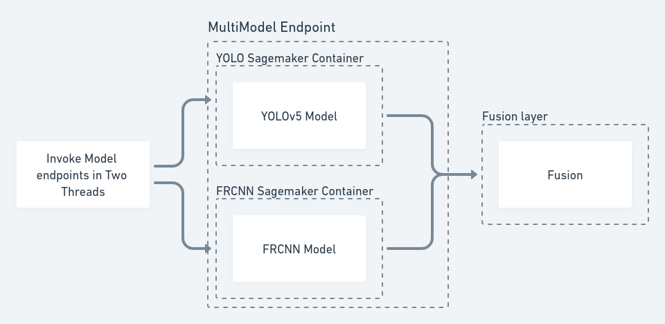

# wenn-skill-test

Skill Test from Wenn.no and SAKS global

## How to run all containers at once
To run all containers at once you can use the docker-compose.yml file and execute following command in commandline interface

docker compose up --build

## How to run indivigual containers
To run indivigual containers you have to first create a docker network using following command

docker network create {network name}

Then navigate to the submodue you want to create and run following command

docker build -t {tag} .
docker run -dp {hostport}:5000 -v {Volumes_to_bind} {tag}

## How to handle inference speed differences between the models to make sure you fuse the correct results

For this I have created a singleton class slightly changing the conventional fuusion singleton class by creating one fusion object per unique id.
When a image is recieved to image uploader it will generate a unique ID (UUID) to the image and pass it to YOLO and FRCNN models.
In the models when publishing results to MQTT broker the generated UUID is also included in the payload so in fusion I can create 
only on fusion instance per UUID. Then I wait until I get detection results from both models and perform the fusion.

## How to deploy into AWS Sagemaker

To deploy ML models to sagemaker first I need to restructure the code which aws sagemaker expects it to be. The structure is as follows;

|--- code
     |--- inference.py
     |--- requirements.txt
|--- model.pth
 
Then a tar ball should be created including all the files and folders mentioned above. It should be ziped.

Created ziped tar balls should be uploaded to a S3 bucket where the sagemaker can download from.

After that either using console, sagemaker SDK or AWS CLI we can deploy models in AWS Sagemaker.

Model deployment architecture will be as follows;

